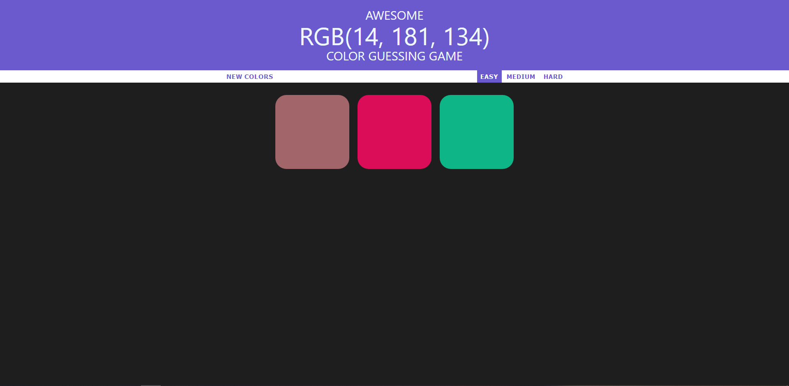
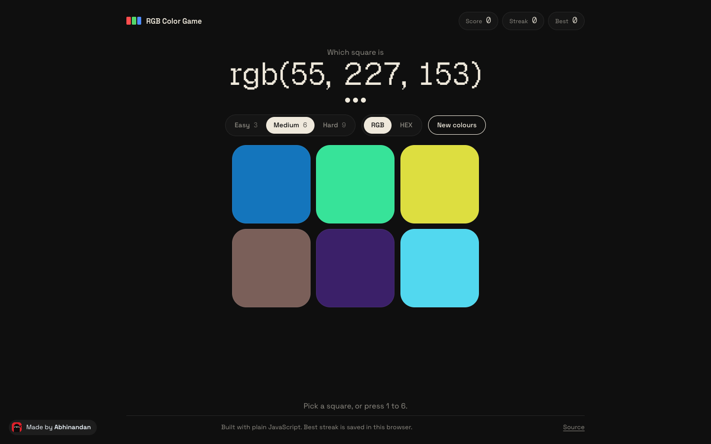

# RGB Color Game

Pick the square that matches the RGB or hex value. Score, streaks, three lives a round, keyboard play (1 to 9, Enter for the next round), and a grid of 3, 6 or 9 colours. Plain JavaScript and CSS, numerals in Geist Pixel.
<strong>Fully responsive

## Three basic modes - 
### 1) EASY -    choose from "3" different colors
### 1) MEDIUM -  choose from "6" different colors
### 1) HARD -    choose from "9" different colors

#### Guess the color of the given RGB value.
**[Play it](https://abhinandansharma.github.io/ColorGame/)** · [CodePen version](https://codepen.io/abhinandansharma/pen/VweErOz)

## EASY
 </img>

## MEDIUM
 </img>

## HARD

### To play locally, just clone it and open index.html file in your browser.

### Clone it 👇
<code> https://github.com/abhinandansharma/ColorGame.git </code>

#### Thanks for checking this out!

