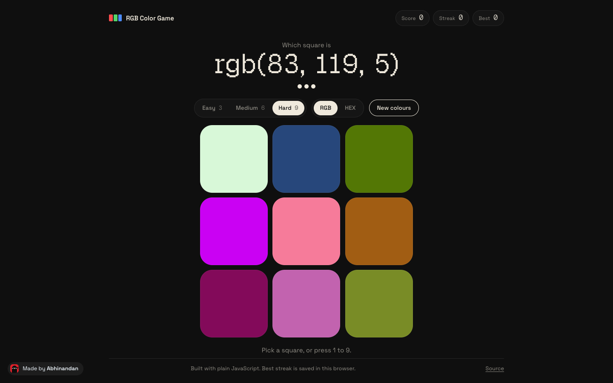
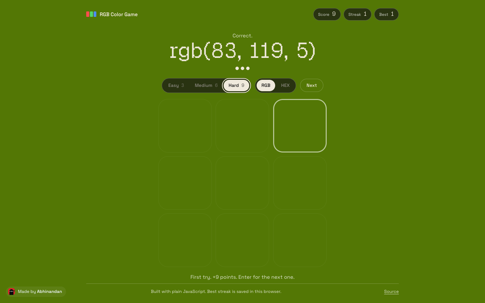

# RGB Color Game

Pick the square that matches the RGB or hex value. Three lives a round, a score that rewards first-try guesses, a streak with your best saved in the browser, and a grid of 3, 6 or 9 colours.

**[Play it](https://abhinandansharma.github.io/ColorGame/)**

## How to play

- The value at the top is the colour you are looking for. Switch between **RGB** and **HEX** notation at any time.
- Click a square, or press **1 to 9**. A wrong square drops out and costs a life; the message tells you how far off you were.
- Get it right and every square, and the page, turns that colour. **Enter** or **Next** starts a new round.
- **Easy**, **Medium** and **Hard** change the grid to 3, 6 or 9 squares. Harder grids score more.

## Hard mode and a win

## Stack

Plain HTML, CSS and JavaScript, no dependencies. Space Grotesk for text and [Geist Pixel](https://vercel.com/font) (Square) for the values, self-hosted. Best streak is stored in `localStorage`.

## Run it locally

Clone the repository and open `index.html` in a browser. The original 2020 version lives on [CodePen](https://codepen.io/abhinandansharma/pen/VweErOz).

Built by [Abhinandan Sharma](https://abhinandansharma.github.io/portfolio/).
